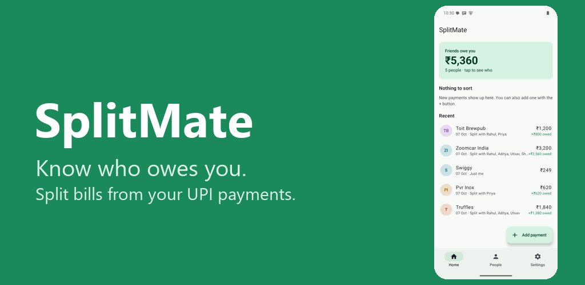
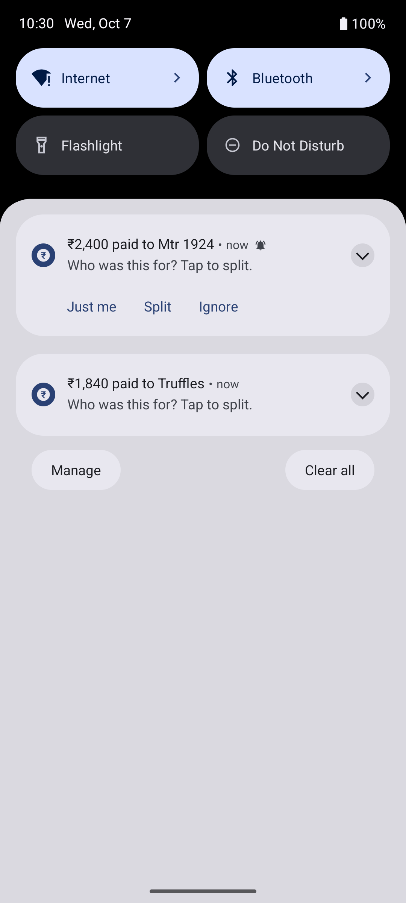
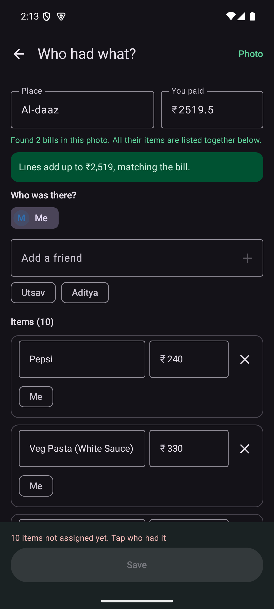
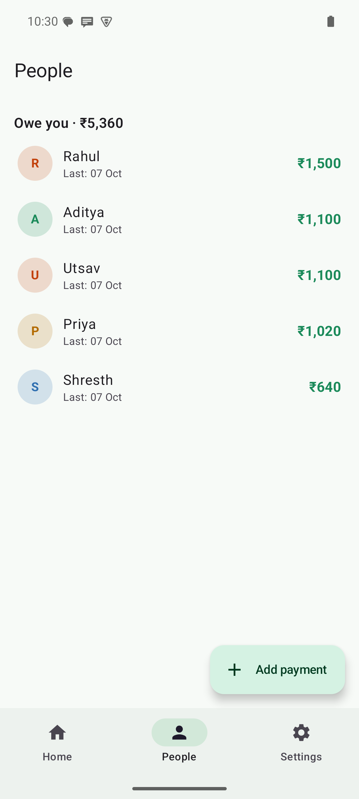

# SplitMate: split bills without the spreadsheet

You pay for dinner on GPay. SplitMate catches the payment and asks one question: **who was this for?** Tap the friends who were there, and it keeps track of who owes you what.

**[⬇ Download SplitMate (latest APK)](https://github.com/mathuryashash/splitmate-releases/releases/latest/download/SplitMate.apk)** · free · Android 8.0+ · 8 MB · v1.2.0

Older or unusual phone and the install fails? Get **SplitMate-universal.apk** (20 MB) from the [release page](https://github.com/mathuryashash/splitmate-releases/releases/latest).

| Catch the payment | Scan the bill: who had what? | See who owes you |
|---|---|---|
|  |  |  |

## What it does

- Picks up payments from GPay, PhonePe, Paytm and other UPI apps, plus bank "Sent Rs…" SMS
- **Scan the bill** (camera, gallery, or share a Zomato/Swiggy screenshot) and tap who had each item. CGST/SGST, service charge and fees are shared in proportion to what each person ordered. Handles two bills in one photo.
- Split equally or by custom amounts, with or without yourself
- **Pick friends from your contacts**, then send each one a WhatsApp reminder in one tap
- **Home-screen widget** showing what friends owe you
- **Backup & restore** to a single file, so changing phones or reinstalling loses nothing
- Shows who owes you and how much, all on one screen
- Weekly reminder, for example "3 people owe you ₹1,750"
- Reminder text includes your UPI pay link
- Notices when a friend pays you back, so you can mark it settled in one tap
- Exports to Excel, and you can add cash payments by hand

## Private by design

- No account, no cloud, no ads, no trackers.
- Bill photos are read **on the phone** (Google ML Kit, offline). Nothing is uploaded.
- **The app has no Internet permission**, so your data cannot leave the phone.
- It only reads notifications from payment apps and SMS from bank sender IDs. It never reads personal messages.
- [Privacy policy](https://mathuryashash.github.io/splitmate/privacy.html)

## Install (2 minutes)

SplitMate isn't on the Play Store yet, so Android shows a few warnings the first time. They're normal for any app installed outside the Play Store.

### 1. Download
Open **[the download link](https://github.com/mathuryashash/splitmate-releases/releases/latest/download/SplitMate.apk)** on your phone. If Chrome says *"This type of file can harm your device"*, tap **Download anyway**.

### 2. Install
1. Open the file from Chrome's download bar, or from **Files → Downloads**.
2. If you see *"not allowed to install unknown apps from this source"*, tap **Settings**, turn on **Allow from this source**, then go back.
3. Tap **Install**.
4. If Play Protect says *"App scan recommended"* or *"Unsafe app blocked"*, tap **More details → Install anyway**. It shows up for every app that isn't from the Play Store.

### 3. Permissions
Open SplitMate and allow **SMS** and **Notifications**. There is **no Contacts permission**: "From contacts" opens Android's own picker, and SplitMate only sees the one contact you pick. When it asks, turn on **Notification access** for SplitMate.

**Toggle greyed out ("Restricted setting")?** Android 13 and newer does this for apps installed outside the Play Store. To fix it:
1. Go to **Settings → Apps → SplitMate**.
2. Tap **⋮** (top right) → **Allow restricted settings**, and confirm with your PIN or fingerprint.
3. Go back to SplitMate and turn the permission on.

**Xiaomi / Redmi / POCO:** go to **Settings → Apps → SplitMate**, turn on **Autostart**, and set **Battery saver → No restrictions**. Otherwise reminders may not arrive.

### Updating
Install the new APK over the old one. Your data stays.

## Verify your download (optional)
Each release lists the APK's SHA-256. On a PC: `certutil -hashfile SplitMate.apk SHA256` (Windows) or `sha256sum SplitMate.apk` (Mac/Linux).

Signed by: `CN=Yashash Mathur, O=SplitMate, L=Bengaluru, C=IN`

Only download SplitMate from this page.

## Feedback
Found a bug or a bank SMS it missed? [Open an issue](https://github.com/mathuryashash/splitmate-releases/issues), or message me on [LinkedIn](https://www.linkedin.com/in/yashash-mathur-5125a1282).

---
Made in Bengaluru by [Yashash Mathur](https://github.com/mathuryashash). The source code is private for now; this repo only hosts releases.
